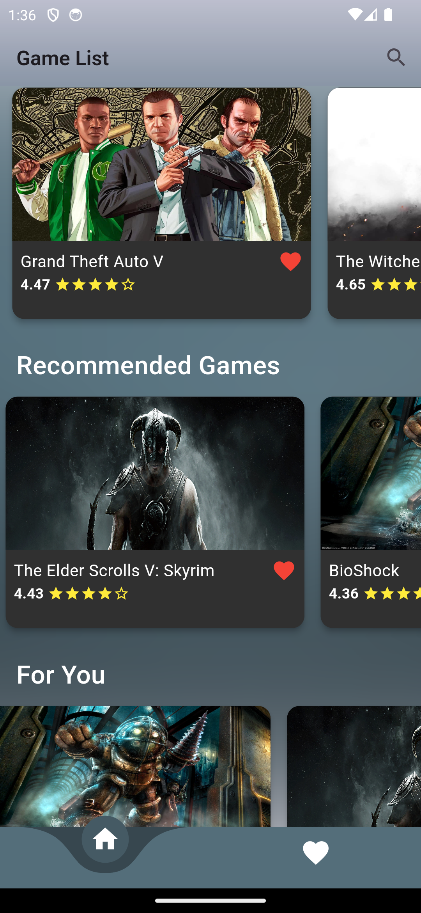
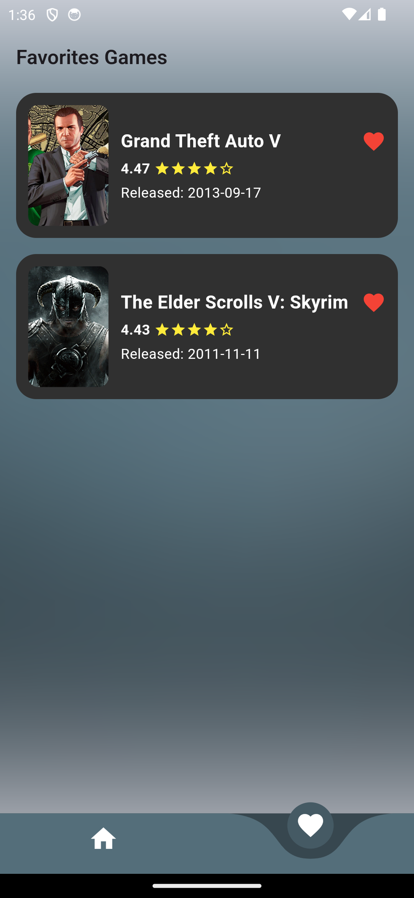
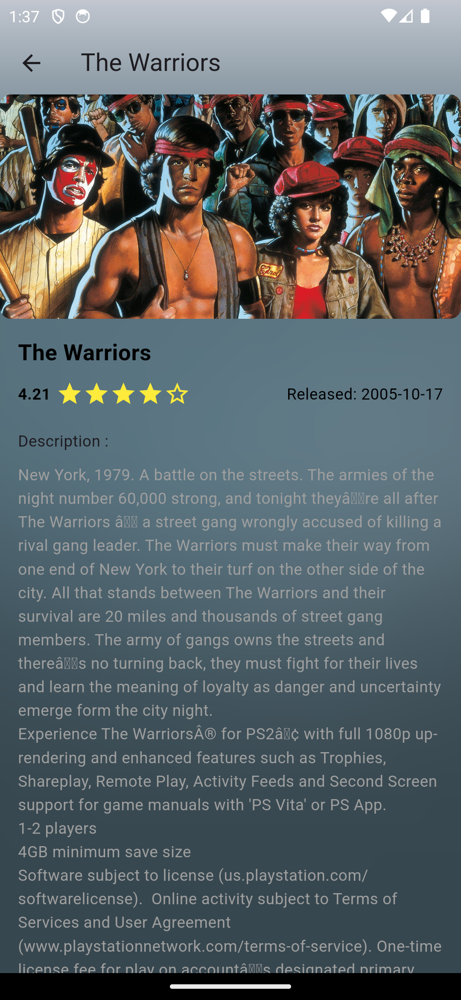

# game_list_app

For Test Case Internship Mobile Developer - CAN Creative

## ✨ Features
- ✅ **MVVM** (Model-View-ViewModel) Architecture
- ✅ **Provider + HTTP** for state management & API handling
- ✅ **Reusable Components** to enhance modularity
- ✅ **Image Caching** for efficient performance

## 📸 Screenshots

 
 

## 🚀 Getting Started

1. **Clone the repository**
   ```sh
   git clone https://github.com/your-username/game_list_app.git
   cd game_list_app
   ```
2. **Install dependencies**
   ```sh
   flutter pub get
   ```
3. **Run the app**
   ```sh
   flutter run
   ```

